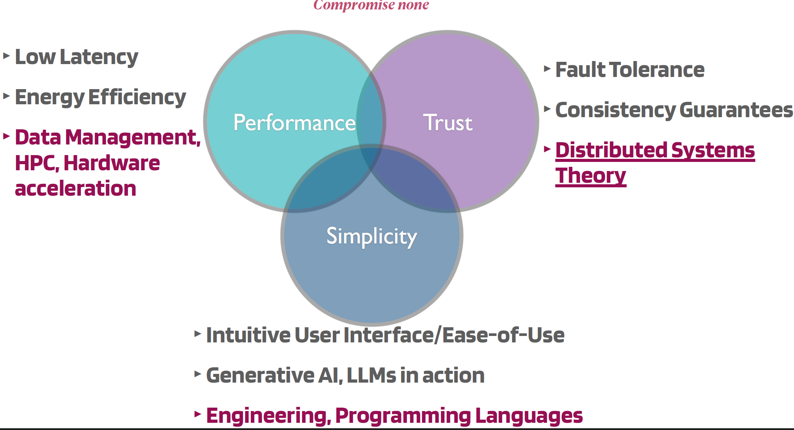

# Module 1 - Introduction to Distributed Systems

## L1 - Overview and Intro

This site to be checked out (developed by course teachers): https://datasystems.nu/.

The course relies on 3 systems principles; **performance**, **trust**, and **simplicity**. You want to have a system that performs very well, that's why a Python script is not enough. Trust is also very important, that's the guarantee that your file wont vanish when a Google Drive server burns down somewhere. Simplicity is what makes the system usable, no matter how powerful and well-performed the system is. 

The course topics (basic in red color):
- $\color{red}Intro \ to \ Distributed \ Systems$
- $\color{red}Fundamental \ Abstractions \ and \ Failure \ Detectors$
- $\color{red}Reliable \ and \ Causal \ Order \ Broadcast$
- $\color{red}Consensus \ (Paxos)$
- Replicated State Machines (OmniPaxos, Raft, Zab etc.)
- Distributed Shared Memory & CRDTs
- Real-Time Abstractions (Spanner, Atomic, Quantum clocks)
- Consistent Snapshotting (Data Management)
- Distributed ACID Transactions (Cloud DBs)

### What is a distributed system?
A set of **nodes**, connected by a **network**, which appear to its users as a **single** coherent system. On the other hand, a **_distributed algorithm_** is a copy of a program running in each process.

### Core Problems in Distributed Systems
#### Consensus problem
Considering the _Two Generals' Problem_, agreement in distributed systems is a core problem.
- Two processes need to agree on a value before a timeout (e.g., execute a program)
- Communicate by messages using unreliable network (as the messenger in Generals' Problem)

Consensus is the process of reaching an agreement on a single data value by all "correct" (non-faulty) nodes (or processes). All nodes/processes propose a value, where some nodes (non correct nodes) might crash & stop responding.
 
The algorithm must ensure a set of properties (specifications):
- All correct nodes eventually decide (agree)
- Every node decides the same (agree)
- Only decide on proposed values

Other problems, similar (and equivalent) to consensus, includes **_Atomic Broadcast_**, where there're multiple nodes/processes one of which broadcasts a message. If the sender doesn't fail (still alive/correct), all correct nodes deliver that message. Another specification is that all correct nodes deliver the same messages. Also, messages are delivered in the same order.
 
Atomic Broadcast is important for building Replicated State Machines RSMs (by allowing multiple servers or processes to execute the same thing, in the same sequence).
 
Furthermore, Atomic Broadcast can be used to solve Consensus (every node broadcasts its proposal, where the first to be received is agreed upon, and all messages are received in the same order). Also, Consensus can be used to solve Atomic Broadcast (more on that later in the course). Thus, Atomic Broadcast is equivalent to Consensus.

#### Models of Distributed Systems
Models here refer to assumptions for building distributed systems. The assumption types to consider here are **_Timing_** and **_Failures_**.
- Timing assumptions (whither we can bound delays; boundless delays $ \to $ zero guarantees):
    * Processes - bounds on time to make a computation step
    * Network - bounds on time to transmit a message between a sender and a receiver
    * Clocks - lower and upper bounds on clock drift rate
- Failure assumptions (the most common assumptions in this course):
    * Processes - what kind of failure can a process exhibit? Crashes and stops. Behaves arbitrary (Byzantine) - different classes of process failures...
    * Network - can a network channel drop messages? Can certain channels temporarily disconnect? (partitions)

When we model a distributed system, we usually try to go to the extremes. We have 2 extremes to address; asynchronous and synchronous systems.
##### The Asynchronous System Model
- No bound on time to compute
- No bound on time to deliver a message
- Clocks are not synchronized

In asynchronous systems, Consensus (agreement) is non-solvable if process crashes can happen. (since consensus is equivalent to atomic broadcast, atomic commit, and leader election ...etc, it applies to them as well, i.e., non-solvable in async systems).

##### The Synchronous System Model
- Known bound on time to compute
- Known bound on time to deliver a message (latency)
- Known lower and upper bounds in physical clock drift rate

Although the second assumption is impossible (knowing time to deliver message), Consensus is solvable in synchronous system with up to $N-1$ crashes. But still it's not useful for Internet, so, how to proceed?

##### Partially Synchronous System Model
A more realistic view of most systems (e.g., over internet) includes that bounds are mostly respected, but occasionally violated (congestion/failures). Partially synchronous systems is therefore a realistic solution:
- Initially the system is asynchronous (no guarantees, but processes will learn the delays)
- Eventually the system becomes synchronous (for a while)

So, it's a good balance between allowing you to not having strong assumptions about the system, and at the same time approximate the actual time delays. Consensus is solvable in any partially synchronous system with up to $N / 2$ crashes (Paxos Algorithm).

##### Failure Detectors
A very important component to build in partially synchronous systems is failure detector that detects crashes. It's implemented by heartbeats and waiting, and it might be initially wrong, but eventually becomes correct. Consensus and Atomic Broadcast are solvable with failure detectors.
